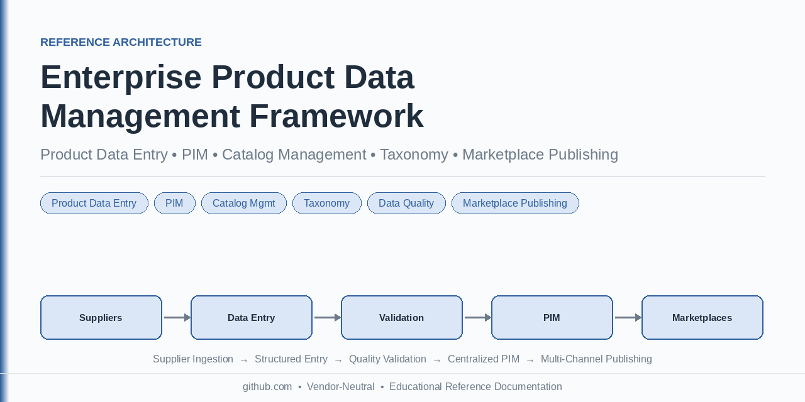
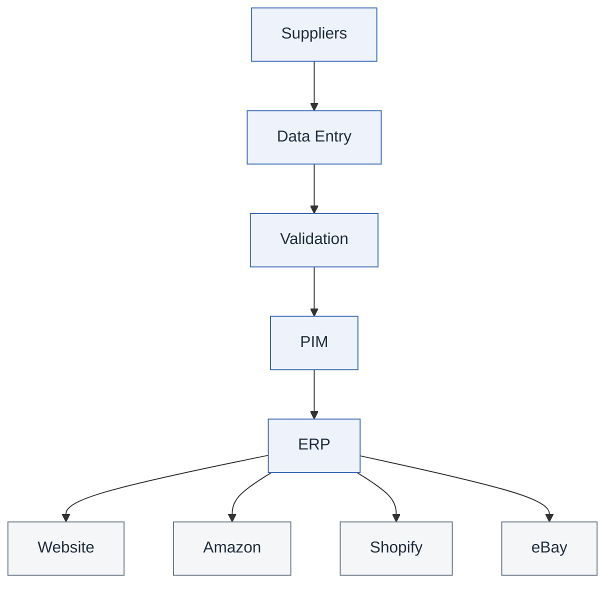
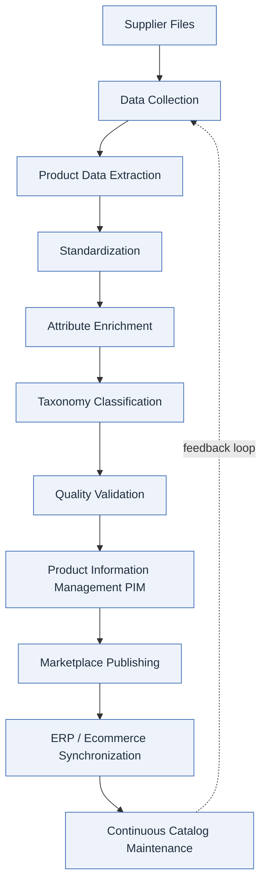
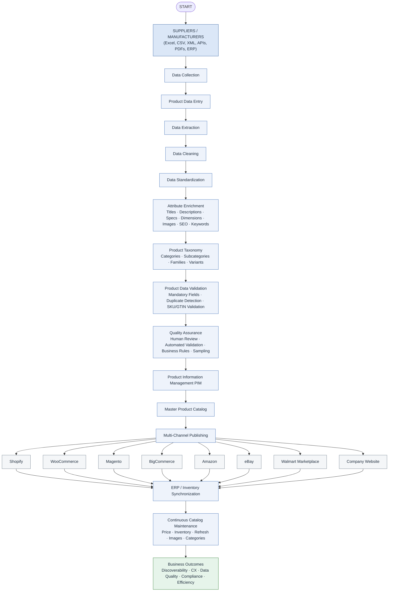
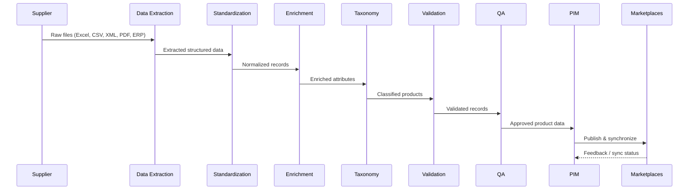
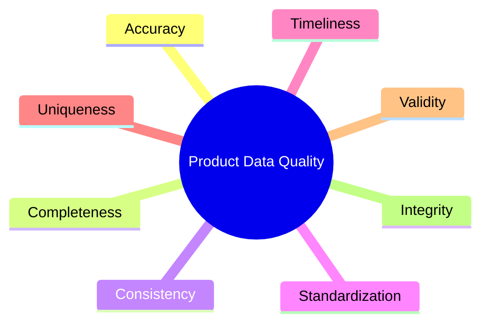
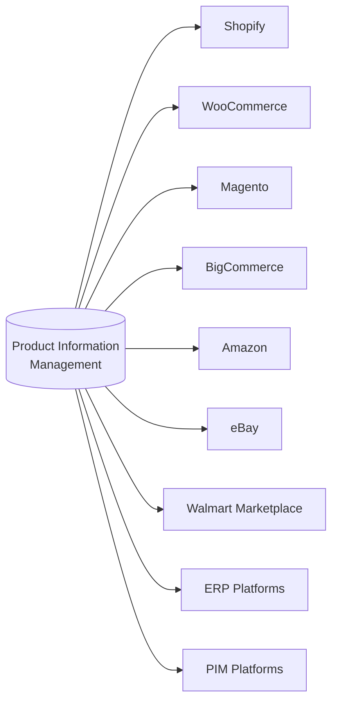
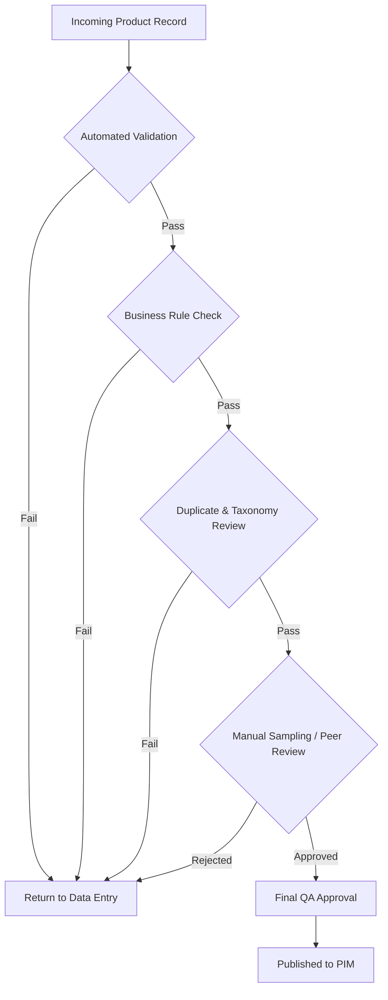
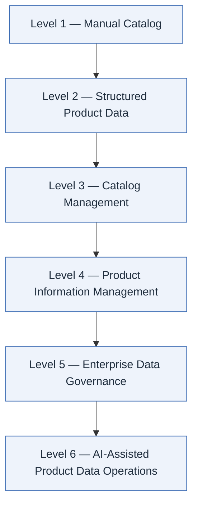

<div align="center">

# Enterprise Product Data Management Framework

**A vendor-neutral reference architecture for product data management, ecommerce catalog operations, PIM, taxonomy design, attribute enrichment, data quality, validation workflows, and marketplace publishing.**

[](#license)
[](#repository-highlights)
[](#documentation-index)
[](#contributing)
[](#contributing)
[](#about-this-project)

</div>

<p align="center">
  
</p>

<div align="center">

**Topics:** Product Data Entry • Product Data Management • PIM • Catalog Management • Product Taxonomy • Ecommerce • Data Quality • Marketplace Publishing

</div>

---

## Table of Contents

- [About This Project](#about-this-project)
- [Repository Highlights](#repository-highlights)
- [Repository at a Glance](#repository-at-a-glance)
- [Key Features](#key-features)
- [Who Should Use This Repository](#who-should-use-this-repository)
- [Quick Start](#quick-start)
- [Topics Covered](#topics-covered)
- [System Architecture Overview](#system-architecture-overview)
- [Enterprise Product Data Lifecycle](#enterprise-product-data-lifecycle)
- [Infographic](#infographic)
- [Repository Structure](#repository-structure)
- [Repository Scope](#repository-scope)
- [Documentation Index](#documentation-index)
- [Product Data Management Workflow](#product-data-management-workflow)
- [Core Components](#core-components)
- [Product Data Quality Dimensions](#product-data-quality-dimensions)
- [Common Product Data Challenges](#common-product-data-challenges)
- [Marketplace Ecosystem](#marketplace-ecosystem)
- [Quality Assurance Framework](#quality-assurance-framework)
- [AI and Human Collaboration](#ai-and-human-collaboration)
- [Maturity Model](#maturity-model)
- [Documentation Roadmap](#documentation-roadmap)
- [Best Practices](#best-practices)
- [References](#references)
- [Educational Purpose](#educational-purpose)
- [Contributing](#contributing)
- [License](#license)
- [Repository Topics](#repository-topics)
- [🌐 Related Resources](#-related-resources)
- [About the Maintainer](#about-the-maintainer)

---

## About This Project

This repository documents enterprise **product data management** concepts, ecommerce catalog workflows, **product information management (PIM)**, and product data quality best practices.

> [!NOTE]
> This documentation is designed as an **educational resource** for ecommerce businesses, data operations teams, product information managers, and marketplace specialists. It is vendor-neutral and does not endorse or require any specific platform or tool.

Modern ecommerce businesses depend on accurate, structured, and scalable product data. Poor-quality catalog information leads to inconsistent customer experiences, lower search visibility, inaccurate inventory, higher return rates, and operational inefficiencies.

This repository provides a technical framework for enterprise product data management — documenting the processes, standards, workflows, governance practices, and quality assurance methods used to build and maintain high-quality ecommerce product catalogs at scale.

---

## Repository Highlights

| | |
|---|---|
| 📐 **Reference Architecture** | End-to-end lifecycle from supplier ingestion to marketplace publishing |
| 🧩 **Modular Documentation** | 12 topic-specific docs covering every stage of catalog operations |
| ✅ **Quality-First Design** | Explicit data quality dimensions and QA frameworks baked into every stage |
| 🗺️ **Maturity Model** | Six-level roadmap from manual catalogs to AI-assisted operations |
| 🔄 **Multi-Channel Ready** | Covers Shopify, WooCommerce, Magento, BigCommerce, Amazon, eBay, Walmart, and more |
| 🧠 **AI + Human Workflows** | Documents where automation helps and where human review remains essential |

---

## Repository at a Glance

- 📄 12+ Documentation Guides
- 📊 15+ Enterprise Workflow Diagrams
- 📚 20+ Product Data Management Best Practices
- 🏪 Multi-Platform Ecommerce Coverage
- 🧩 Product Information Management (PIM)
- ✅ Data Quality & Governance Frameworks
- 🤖 AI + Human Product Data Operations

---

## Key Features

- **Complete lifecycle documentation** — from raw supplier files to continuous catalog maintenance
- **Structured taxonomy guidance** — categories, subcategories, product families, and variants
- **Attribute enrichment standards** — titles, descriptions, specifications, SEO metadata
- **Validation and QA frameworks** — mandatory fields, duplicate detection, SKU/GTIN validation
- **Marketplace publishing guidance** — multi-channel syndication best practices
- **Governance and maturity modeling** — a path from manual processes to enterprise-grade governance
- **Mermaid-based architecture diagrams** — visual, versionable, and easy to extend

---

## Who Should Use This Repository

<table>
<tr><td>

- Ecommerce Operations Teams
- Product Information Managers
- Product Data Specialists
- Marketplace Managers
- Digital Commerce Teams

</td><td>

- Data Operations Teams
- Catalog Management Teams
- ERP Consultants
- PIM Consultants
- Ecommerce Developers & Business Analysts

</td></tr>
</table>

---

## Quick Start

<details>
<summary><strong>1. Explore the lifecycle</strong> — click to expand</summary>

Start with the [Enterprise Product Data Lifecycle](#enterprise-product-data-lifecycle) diagram to understand the end-to-end flow, then drill into the [Documentation Index](#documentation-index) for the stage you care about.
</details>

<details>
<summary><strong>2. Review the core components</strong> — click to expand</summary>

Read [Core Components](#core-components) to understand how Product Data Entry, PIM, Taxonomy, Attribute Enrichment, and Validation fit together.
</details>

<details>
<summary><strong>3. Check quality dimensions and QA</strong> — click to expand</summary>

Review [Product Data Quality Dimensions](#product-data-quality-dimensions) and the [Quality Assurance Framework](#quality-assurance-framework) before designing validation rules.
</details>

<details>
<summary><strong>4. Assess your maturity level</strong> — click to expand</summary>

Use the [Maturity Model](#maturity-model) to benchmark your organization and plan next steps.
</details>

---

## Topics Covered

This repository documents enterprise practices for:

<table>
<tr>
<td>

- Product Data Management
- Product Catalog Management
- Product Information Management (PIM)
- Product Data Entry Workflows
- Product Attribute Enrichment
- Product Taxonomy Design

</td>
<td>

- Product Categorization
- SKU Management
- Product Data Quality
- Data Validation
- Catalog Standardization
- Product Data Migration

</td>
<td>

- Marketplace Listing Preparation
- Bulk Product Upload Operations
- Ecommerce Data Governance
- Human Review & Quality Assurance
- AI-Assisted Product Data Processing

</td>
</tr>
</table>

---

## System Architecture Overview

A bird's-eye view of how product data flows through the system before diving into the detailed lifecycle below.



> [!TIP]
> This is the simplified mental model. The [Enterprise Product Data Lifecycle](#enterprise-product-data-lifecycle) below expands each stage into its full sub-processes.

---

## Enterprise Product Data Lifecycle



> [!TIP]
> Catalog maintenance feeds back into data collection — this is a **continuous loop**, not a one-time project.

### Full Enterprise Workflow (Detailed)



### Core Components ↔ Quality Dimensions

```mermaid
flowchart LR
    subgraph Core["Core Components"]
        direction TB
        C1[Product Data Entry]
        C2[Catalog Management]
        C3["Product Information<br/>Management (PIM)"]
        C4[Product Data Quality]
        C5[Product Taxonomy]
        C6[Attribute Enrichment]
        C7[Data Validation]
        C8[Quality Assurance]
        C9[Marketplace Publishing]
        C10[Product Governance]
    end

    subgraph Quality["Enterprise Quality Dimensions"]
        direction TB
        Q1[Accuracy]
        Q2[Completeness]
        Q3[Consistency]
        Q4[Timeliness]
        Q5[Validity]
        Q6[Uniqueness]
        Q7[Integrity]
        Q8[Standardization]
    end

    Core -.governs.-> Quality
```



---

## Infographic

> [!NOTE]
> A high-resolution SVG/PNG infographic for this framework is planned but not yet included in this repository.

<div align="center">

<!--
  PLACEHOLDER: Replace the line below with the final infographic asset.
  Recommended path: assets/enterprise-product-data-framework.svg
  Fallback path:    assets/enterprise-product-data-framework.png
-->

```
┌─────────────────────────────────────────────────────────┐
│                                                           │
│        [ Infographic Placeholder — 1600×1000 ]           │
│                                                           │
│   Replace this block with:                               │
│   assets/enterprise-product-data-framework.svg           │
│                                                           │
└─────────────────────────────────────────────────────────┘
```

*Once available, embed with:*
```markdown

```

</div>

---

## Repository Structure

```
enterprise-product-data-management/
│
├── README.md
├── banner.png
│
├── docs/
│   ├── 01-product-data-lifecycle.md
│   ├── 02-product-catalog-management.md
│   ├── 03-product-information-management.md
│   ├── 04-product-attribute-enrichment.md
│   ├── 05-product-taxonomy.md
│   ├── 06-marketplace-requirements.md
│   ├── 07-product-data-quality.md
│   ├── 08-product-data-validation.md
│   ├── 09-ai-assisted-product-data.md
│   ├── 10-enterprise-workflows.md
│   ├── 11-security-and-governance.md
│   └── 12-best-practices.md
│
├── assets/
│   ├── workflow.png
│   ├── catalog-workflow.png
│   ├── taxonomy.png
│   ├── pim-architecture.png
│   └── qa-workflow.png
│
└── examples/
    ├── sample-catalog.csv
    ├── sample-product-template.xlsx
    └── sample-taxonomy.md
```

---

## Repository Scope

- **12** documentation guides covering the full product data lifecycle
- **15+** enterprise workflow patterns, from supplier onboarding to catalog maintenance
- **20+** documented best practices for governance and standardization
- Full coverage of the **Product Data Lifecycle**, **Product Taxonomy**, and **Marketplace Publishing**
- Dedicated framework for **Product Information Management (PIM)**
- Structured **Data Quality Framework** with 8 measurable dimensions

---

## Documentation Index

| # | Document | Description |
|---|----------|--------------|
| 01 | [Product Data Lifecycle](docs/01-product-data-lifecycle.md) | End-to-end lifecycle from supplier to catalog maintenance |
| 02 | [Product Catalog Management](docs/02-product-catalog-management.md) | Categories, variants, pricing, specs, digital assets |
| 03 | [Product Information Management](docs/03-product-information-management.md) | Centralizing product content across channels |
| 04 | [Product Attribute Enrichment](docs/04-product-attribute-enrichment.md) | Specifications, compatibility, SEO metadata |
| 05 | [Product Taxonomy](docs/05-product-taxonomy.md) | Category structures, navigation, merchandising |
| 06 | [Marketplace Requirements](docs/06-marketplace-requirements.md) | Channel-specific listing and compliance rules |
| 07 | [Product Data Quality](docs/07-product-data-quality.md) | Quality dimensions and measurement |
| 08 | [Product Data Validation](docs/08-product-data-validation.md) | Automated and manual validation rules |
| 09 | [AI-Assisted Product Data](docs/09-ai-assisted-product-data.md) | Where automation helps, where humans lead |
| 10 | [Enterprise Workflows](docs/10-enterprise-workflows.md) | Operational workflow patterns |
| 11 | [Security and Governance](docs/11-security-and-governance.md) | Data governance and secure handling |
| 12 | [Best Practices](docs/12-best-practices.md) | Standardized models, controlled vocabularies |

---

## Product Data Management Workflow

A typical enterprise workflow consists of:

1. Collect product information from suppliers.
2. Extract product information from structured and unstructured sources.
3. Normalize formats and units.
4. Standardize naming conventions.
5. Enrich product attributes.
6. Assign product taxonomy.
7. Validate mandatory fields.
8. Perform quality assurance.
9. Publish to PIM.
10. Synchronize with ecommerce platforms and marketplaces.
11. Monitor and maintain catalog quality.



---

## Core Components

<details open>
<summary><strong>Product Data Entry</strong></summary>
<br>

Capturing structured product information from supplier catalogs, PDFs, spreadsheets, ERP exports, websites, and other data sources.

Organizations managing enterprise ecommerce catalogs often rely on structured [Product Data Entry](https://www.precisebposolution.com/product-data-entry.html) processes to ensure product accuracy, consistency, and marketplace readiness.
</details>

<details>
<summary><strong>Product Catalog Management</strong></summary>
<br>

Managing complete product catalogs including categories, variants, pricing, specifications, digital assets, inventory references, and lifecycle updates.

Many organizations combine structured data entry with [Data Conversion](https://www.precisebposolution.com/data-conversion.html) during catalog migration and supplier onboarding, when legacy formats need to be normalized into a common catalog schema.
</details>

<details>
<summary><strong>Product Information Management (PIM)</strong></summary>
<br>

Centralizing product information to distribute consistent product content across ecommerce websites, marketplaces, ERP systems, and marketing channels.
</details>

<details>
<summary><strong>Product Attribute Enrichment</strong></summary>
<br>

Enhancing product records with standardized specifications, technical details, compatibility information, dimensions, materials, SEO metadata, and customer-facing descriptions.
</details>

<details>
<summary><strong>Product Taxonomy</strong></summary>
<br>

Designing scalable category structures that improve navigation, search filtering, reporting, merchandising, and marketplace compliance.
</details>

<details>
<summary><strong>Product Data Validation</strong></summary>
<br>

Verifying data accuracy through automated validation rules and human quality review before publication.
</details>

---

## Product Data Quality Dimensions

Enterprise product data quality typically focuses on:



| Dimension | Description |
|---|---|
| **Accuracy** | Data correctly reflects the real-world product |
| **Completeness** | All required attributes are populated |
| **Consistency** | Data is uniform across systems and channels |
| **Standardization** | Formats, units, and naming follow defined conventions |
| **Timeliness** | Data is current and updated on schedule |
| **Uniqueness** | No unintended duplicate records |
| **Validity** | Data conforms to defined formats and business rules |
| **Integrity** | Relationships between data entities remain intact |

---

## Common Product Data Challenges

> [!WARNING]
> Organizations managing large catalogs often encounter the following recurring issues.

- Duplicate SKUs
- Missing attributes
- Supplier inconsistencies
- Incorrect measurements
- Category mismatch
- Broken taxonomy
- Poor product descriptions
- Missing images
- Invalid GTINs
- Marketplace validation failures
- Variant inconsistencies
- Data synchronization issues

---

## Marketplace Ecosystem

Enterprise product data frequently supports:



> [!TIP]
> Large catalog publishing projects often begin with [Online Data Entry](https://www.precisebposolution.com/online-data-entry.html) workflows to structure raw supplier data before it is mapped to marketplace-specific fields.

---

## Quality Assurance Framework

Typical quality control includes:

- Automated validation
- Business rule validation
- Mandatory field verification
- Duplicate detection
- Attribute validation
- Taxonomy review
- Manual sampling
- Peer review
- Final QA approval



---

## AI and Human Collaboration

Modern product data operations often combine automation with human expertise.

<table>
<tr>
<th>🤖 Automation may assist with</th>
<th>🧑‍💼 Human review remains important for</th>
</tr>
<tr>
<td>

- OCR
- Data extraction
- Attribute suggestions
- Duplicate detection
- Classification
- Validation support

</td>
<td>

- Product interpretation
- Taxonomy decisions
- Marketplace compliance
- Quality assurance
- Complex product attributes
- Business rule exceptions

</td>
</tr>
</table>

> [!IMPORTANT]
> Automation accelerates throughput, but human judgment remains the final checkpoint for compliance-sensitive and ambiguous decisions.

---

## Maturity Model



| Level | Stage | Description |
|---|---|---|
| 1 | Manual Catalog | Spreadsheets and ad-hoc processes |
| 2 | Structured Product Data | Defined fields and basic standardization |
| 3 | Catalog Management | Centralized catalog with lifecycle tracking |
| 4 | Product Information Management | Dedicated PIM with multi-channel distribution |
| 5 | Enterprise Data Governance | Formal governance, ownership, and policy |
| 6 | AI-Assisted Product Data Operations | Automation-augmented enrichment and QA |

---

## Documentation Roadmap

### Current Documentation

- ✅ Product Lifecycle
- ✅ Catalog Management
- ✅ Product Information Management (PIM)
- ✅ Product Taxonomy
- ✅ Quality Assurance

### Upcoming

**Platform & feed integrations**
- ⬜ Product Feed Optimization
- ⬜ Google Merchant Center Integration
- ⬜ Amazon Flat File Guidance
- ⬜ Shopify CSV Import Workflows
- ⬜ WooCommerce Import Workflows
- ⬜ Akeneo PIM Reference Notes
- ⬜ Pimcore Reference Notes
- ⬜ Syndigo Integration Notes
- ⬜ Salsify Integration Notes
- ⬜ GS1 Product Data Alignment

**Core documentation**
- ⬜ Product taxonomy templates
- ⬜ Catalog migration checklists
- ⬜ Sample QA frameworks
- ⬜ Product attribute standards
- ⬜ Marketplace field mapping
- ⬜ Product data governance
- ⬜ Bulk upload templates
- ⬜ Validation rules
- ⬜ Data quality metrics

> [!NOTE]
> This roadmap reflects an actively evolving documentation set. Items move from **Upcoming** to **Current** as they are published — see [Contributing](#contributing) if you'd like to help prioritize or draft any of these.

---

## Best Practices

Enterprise product data management should emphasize:

- Standardized data models
- Controlled vocabularies
- Consistent taxonomy
- Attribute governance
- Structured validation
- Continuous quality monitoring
- Documentation
- Version control
- Secure data handling
- Scalable workflows

---

## References

This framework is informed by publicly available, vendor-neutral standards and platform documentation:

| Source | Relevance |
|---|---|
| [GS1 Standards](https://www.gs1.org/standards) | Global standards for product identifiers (GTIN, barcodes) and master data |
| [schema.org — Product](https://schema.org/Product) | Structured data vocabulary for describing products on the web |
| [Shopify Developer Documentation](https://shopify.dev/docs) | Platform-specific product and catalog data model reference |
| [WooCommerce Documentation](https://woocommerce.com/documentation/) | Product data structure and catalog management for WooCommerce |
| [Adobe Commerce (Magento) Developer Docs](https://developer.adobe.com/commerce/docs/) | Catalog architecture and attribute management reference |

> [!NOTE]
> These references are provided for educational context only. This repository is not affiliated with, endorsed by, or officially connected to GS1, schema.org, Shopify, WooCommerce, or Adobe Commerce.

---

## Educational Purpose

> [!NOTE]
> This repository is intended as an **educational technical reference** describing enterprise product data management concepts, workflows, governance practices, and documentation approaches. It is designed to support learning, process improvement, and discussion within ecommerce and product data operations.

---

## Contributing

Contributions that improve clarity, accuracy, or completeness of this vendor-neutral documentation are welcome.

1. Fork the repository
2. Create a feature branch (`git checkout -b docs/improve-taxonomy-section`)
3. Make your changes, keeping content vendor-neutral and educational
4. Submit a pull request describing the change and its rationale

> [!TIP]
> Documentation-only changes (typos, clarity, diagrams) are especially welcome and typically easy to review.

---

## License

This documentation is provided for **educational purposes** under a **Creative Commons Attribution 4.0 (CC BY 4.0)** style license unless otherwise noted. You are free to share and adapt the material with appropriate attribution.

---

## Repository Topics

> [!NOTE]
> These are suggested GitHub repository topics to improve discoverability. Add them via the repository's **About → Topics** settings on GitHub.

`product-data-management` · `product-data-entry` · `catalog-management` · `product-information-management` · `pim` · `ecommerce` · `taxonomy` · `data-quality` · `catalog` · `marketplace` · `shopify` · `woocommerce` · `magento` · `amazon` · `data-governance`

### Social Preview

> [!NOTE]
> A 1280×640 social preview banner is recommended for this repository (set via **Settings → Social Preview** on GitHub).
>
> - **Title:** Enterprise Product Data Management Framework
> - **Subtitle:** Reference Architecture • PIM • Catalog Management • Product Data Entry • QA
>
> Once created, place the asset at `assets/social-preview.png` and reference it here.

---

## 🌐 Related Resources

This repository is part of a broader knowledge base on enterprise product data management and ecommerce data operations.

| Resource | Description |
|----------|-------------|
| **[Product Data Entry Services](https://www.precisebposolution.com/product-data-entry.html)** | Comprehensive enterprise product data entry solutions for ecommerce catalogs, covering supplier data capture, normalization, and catalog-ready formatting. |
| **[Online Data Entry Services](https://www.precisebposolution.com/online-data-entry.html)** | Scalable online data entry workflows for high-volume, structured business data processing. |
| **[Data Conversion Services](https://www.precisebposolution.com/data-conversion.html)** | Format and structure conversion services supporting catalog migration, supplier onboarding, and legacy data modernization. |
| **[Enterprise Data Labeling Services](https://www.precisebposolution.com/data-labeling-services.html)** | AI training data labeling and annotation services supporting classification and enrichment workflows. |
| **[Official Blog](https://www.precisebposolution.com/blog/)** | Articles and implementation guides on product data entry, catalog operations, and data conversion workflows. |
| **[Company Website](https://www.precisebposolution.com/)** | Primary website for Precise BPO Solution's enterprise data services. |

> [!TIP]
> As specific articles are published — for example, guides on product data entry best practices, online data entry workflows, or data conversion processes — link to those individual posts here rather than the general blog homepage.

These resources provide additional documentation, implementation guides, enterprise workflows, and service-specific information related to product data management and digital commerce operations.

---

## About the Maintainer

This repository is maintained by **Precise BPO Solution**, a provider of enterprise data entry, product data management, AI data labeling, and data processing solutions.

**Website:** [www.precisebposolution.com](https://www.precisebposolution.com)

**Explore related services:**
- [Product Data Entry](https://www.precisebposolution.com/product-data-entry.html)
- [Online Data Entry](https://www.precisebposolution.com/online-data-entry.html)
- [Data Conversion](https://www.precisebposolution.com/data-conversion.html)
- [AI Data Labeling](https://www.precisebposolution.com/data-labeling-services.html)

---

<div align="center">

Enterprise Data Entry • AI Data Labeling • Data Conversion • Document Processing

© 2026 Precise BPO Solution

</div>
